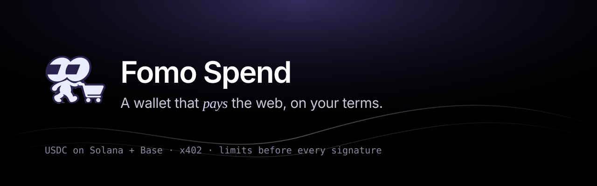
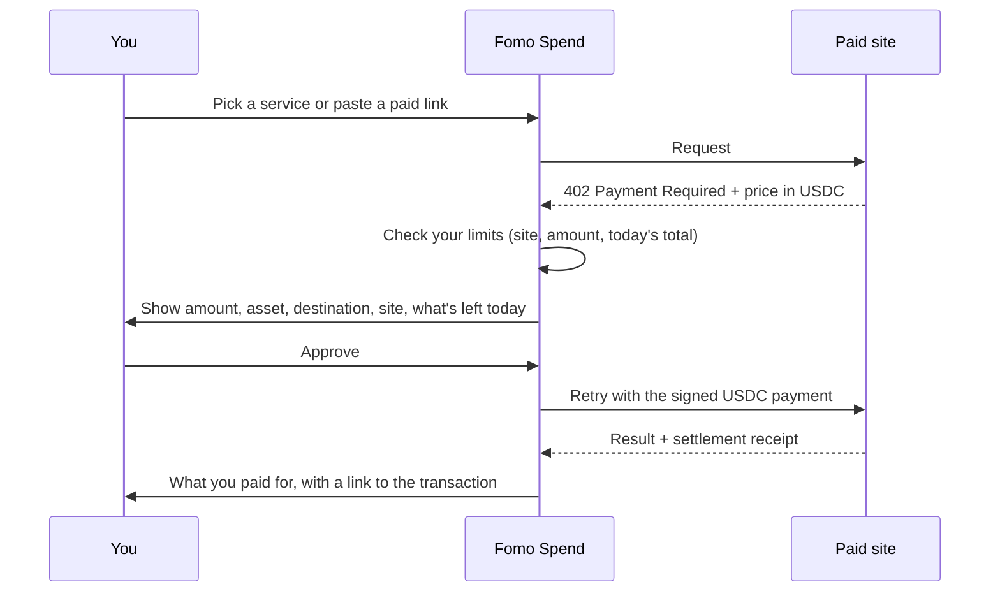

<p align="center">
  <a href="https://fomospend.xyz"></a>
</p>

<p align="center">
  <a href="https://fomospend.xyz"></a>
  <a href="https://fomospend.xyz/app"></a>
  <a href="https://x.com/FomoSpendX402"></a>
  <br>
  
  
  
  
  
</p>

# Fomo Spend

**Your Fomo cash, spendable anywhere that asks for payment.**

Some sites and AI tools charge a few cents per use instead of a subscription: a web search for less than a cent, a coin price for a cent, a gift card for its face value. They ask for payment with an open standard called **x402**. Fomo Spend is the wallet that answers: it pays those requests in USDC, only inside limits you set, and shows you every payment before anything is signed.

- **Pick and pay:** search, crypto data and gift cards, set up in one click.
- **Your limits first:** allowed sites, a per-payment max and a per-day max, checked before any signature.
- **You approve every payment:** amount, asset, who gets paid, the site, and what's left of today's budget.
- **Bring any wallet, or none:** Phantom, Solflare, Backpack, MetaMask, Coinbase Wallet, Rabby. Or sign in with email or Google and a wallet is created for you.
- **Agents too:** give an AI agent its own budget over MCP or the CLI. It can't raise its own limits.

**Open the app:** https://fomospend.xyz/app · **Follow updates on X:** [@FomoSpendX402](https://x.com/FomoSpendX402)

## How a payment works



Nothing is signed if a limit fails or you reject the payment.

## Documentation

| If you want to… | Read |
| --- | --- |
| Understand what this is, in plain words | [What is x402?](docs/what-is-x402.md) |
| Pay for something from your browser | [Getting started](docs/getting-started.md) |
| Buy a gift card | [Gift cards](docs/gift-cards.md) |
| See what you can pay for | [Services](docs/services.md) |
| Control how much can be spent | [Limits](docs/limits.md) |
| Give an AI agent a budget | [Agents and MCP](docs/agents.md) |
| Use the command line | [CLI reference](docs/cli.md) |
| Know what Fomo Spend can and can't do with your money | [Security](docs/security.md) |
| Quick answers | [FAQ](docs/faq.md) |

## Supported networks and assets

| Network | Asset | Token address |
| --- | --- | --- |
| Solana mainnet | USDC | `EPjFWdd5AufqSSqeM2qN1xzybapC8G4wEGGkZwyTDt1v` |
| Base mainnet | USDC | `0x833589fCD6eDb6E08f4c7C32D4f71b54bdA02913` |

Only USDC is ever paid. Other tokens and networks are refused, not converted. When a seller accepts both networks, Fomo Spend uses Solana. Network fees for payments are covered by the seller's side, so you only need USDC.

## Supported wallets

| How | Wallets |
| --- | --- |
| Solana (Wallet Standard) | Phantom, Solflare, Backpack, and other Wallet Standard wallets |
| Base (EIP-6963) | MetaMask, Coinbase Wallet, Rabby, and other injected wallets |
| Email or Google | A Solana and a Base wallet created for you by Privy |
| Agents | The `fomo-spend` CLI and MCP server, with an encrypted local key |

## Quick start for agents

```sh
npm install -g https://fomospend.xyz/fomo-spend.tgz
fomo-spend init
fomo-spend policy set --max-request 1 --max-day 10
fomo-spend policy allow api.exa.ai
claude mcp add fomo-spend --env FOMO_SPEND_PASSPHRASE=… -- fomo-spend mcp
```

Full guide: [Agents and MCP](docs/agents.md).

## Security

Fomo Spend never signs a payment that fails your limits, never signs token approvals, and never holds your keys on its servers. Read [Security](docs/security.md). To report a vulnerability, use this repository's **Security → Report a vulnerability** tab ([policy](SECURITY.md)).

## Links

- Website: https://fomospend.xyz
- App: https://fomospend.xyz/app
- X: https://x.com/FomoSpendX402

---

<sub>Names and logos of third-party services belong to their owners. Fomo Spend is not affiliated with or endorsed by the services it can pay. Gift cards are sold and delivered by Bitrefill.</sub>
